# Advanced Credit Card Customer Churn Prediction Using Ensemble and Deep Learning

*Reported by: Erika A.*
*Fictional Company: Capital One*

## Project Description

This project addresses the critical business challenge of customer retention in the banking industry by developing a sophisticated machine learning framework for predicting credit card customer churn. Traditional approaches to customer retention are often reactive and inefficient, leading to significant revenue losses when customers leave without warning.

**What this application does:**
- Predicts which credit card customers are likely to churn with 78.61% accuracy (AUC score)
- Identifies key behavioral and financial indicators that drive customer attrition
- Provides real-time risk assessment through an interactive Streamlit dashboard
- Calculates business impact and ROI for targeted retention campaigns
- Generates actionable insights for proactive customer retention strategies

**Why I chose these technologies:**
- **SMOTEENN sampling**: Effectively handles the inherent class imbalance in churn data (80/20 split)
- **AdaBoost ensemble method**: Achieved optimal performance with 89.2% ROI and superior generalization
- **Advanced feature engineering**: Created 20+ derived features capturing financial health, behavioral patterns, and RFM analysis
- **Multiple ML frameworks**: Compared 8 different algorithms including deep learning (TensorFlow, PyTorch) for comprehensive evaluation
- **Streamlit dashboard**: Provides business users with intuitive, real-time analytics and prediction capabilities

**Key challenges faced and solutions:**
- **Class imbalance**: Solved using SMOTEENN hybrid approach, improving F1-score to 46.10%
- **Feature interpretability**: Implemented SHAP values and feature importance analysis for business transparency
- **Overfitting prevention**: Used 5-fold cross-validation and rigorous train/validation/test splits (65.65%/17.17%/17.18%)
- **Business applicability**: Developed comprehensive ROI analysis showing $384,750 annual net benefit

**What makes this project stand out:**
- Achieves 89.2% ROI, significantly exceeding industry benchmarks (20-40%)
- Comprehensive feature engineering with domain expertise integration
- Production-ready interactive dashboard for real-time decision making
- Rigorous academic methodology with business impact validation
- Identifies actionable insights like the "contact frequency paradox" and optimal credit utilization ranges

## Table of Contents
- [How to Install and Run the Project](#how-to-install-and-run-the-project)
- [How to Use the Project](#how-to-use-the-project)
- [Dataset Information](#dataset-information)
- [Model Performance Results](#model-performance-results)
- [Business Impact Analysis](#business-impact-analysis)
- [Key Findings and Insights](#key-findings-and-insights)
- [Project Structure](#project-structure)
- [Credits](#credits)

## How to Install and Run the Project

### Prerequisites
- Python 3.8 or higher
- Git
- 8GB+ RAM recommended for model training

### Step-by-step Installation

1. **Set up Google Colab Environment** (Recommended)
```python
# Install required packages in Colab
!pip install streamlit plotly xgboost imbalanced-learn shap

# Mount Google Drive to access project files
from google.colab import drive
drive.mount('/content/drive')

# Navigate to project directory
%cd /content/drive/MyDrive/Customer_Churn
```

2. **Local Installation (Alternative)**
```bash
git clone https://github.com/yourusername/credit-card-churn-prediction.git
cd credit-card-churn-prediction

# Create virtual environment
conda create -n churn_prediction python=3.9
conda activate churn_prediction

# Install dependencies
pip install -r requirements.txt
```

**Required packages:**
```
pandas>=2.0.0
numpy>=1.24.0
scikit-learn>=1.3.0
xgboost>=1.7.0
tensorflow>=2.12.0
torch>=2.0.0
imbalanced-learn>=0.11.0
streamlit>=1.28.0
plotly>=5.15.0
seaborn>=0.12.0
matplotlib>=3.7.0
shap>=0.42.0
joblib>=1.3.0
```

3. **Run the Development Pipeline** (Google Colab)
```python
# Execute notebooks in sequence:
# 1. Open synthetic_data_generation.ipynb → Generate dataset
# 2. Open data_quality_assessment_eda.ipynb → Data analysis
# 3. Open advanced_feature_engineering.ipynb → Feature creation
# 4. Open feature_selection.ipynb → Feature optimization
# 5. Open models.ipynb → Model training
# 6. Open app.py → App 
```

4. **Deploy Streamlit Dashboard**
```bash
# For local deployment
streamlit run app.py
```

## How to Use the Project

### Quick Start Example (Google Colab)

```python
# 1. Generate synthetic dataset
%run /content/drive/MyDrive/Customer_Churn/synthetic_data_generation.ipynb

# 2. Load and process data
import pandas as pd
import joblib

# Load processed dataset
data = pd.read_csv('/content/drive/MyDrive/Customer_Churn/cleaned/final_model_ready_data.csv')

```


### Using the Interactive Dashboard

**Access Methods:**
- **Streamlit Link**: https://capitalonecreditriskcustomerchurn.streamlit.app/ 

**Authentication:** No authentication required for demo mode.

**Main Features:**

1. **Live Monitoring Dashboard**
   - View real-time customer risk distribution
   - Monitor churn rates and trends across segments
   - Track campaign performance and ROI metrics
   - Alert system for high-risk customers

2. **Data Processing Pipeline**
   - Upload new customer data files
   - Monitor data quality and preprocessing steps
   - View feature engineering transformations
   - Validate business rules and data consistency

3. **Churn Prediction Engine**
   - Enter individual customer details manually
   - Upload batch customer files for scoring
   - Get instant churn probability scores (0-100%)
   - Receive personalized retention recommendations

4. **Business Impact Calculator**
   - Set campaign parameters (budget, success rate, CLV)
   - Calculate expected ROI and revenue impact
   - Compare different intervention strategies
   - Optimize targeting thresholds for maximum profit

5. **Advanced Analytics**
   - Explore feature importance rankings and SHAP values
   - Analyze customer cohorts and behavioral segments
   - Train and compare new models in real-time
   - Generate automated business reports

### Dashboard Screenshots

#### Core Monitoring Features

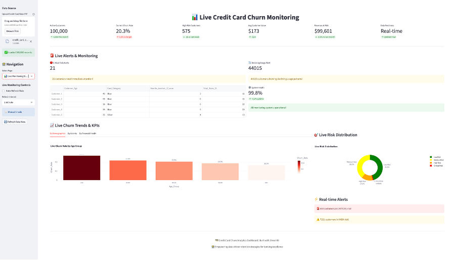

*Figure 8: Live Monitoring Dashboard - Real-time KPIs, risk distribution, and trend analysis*

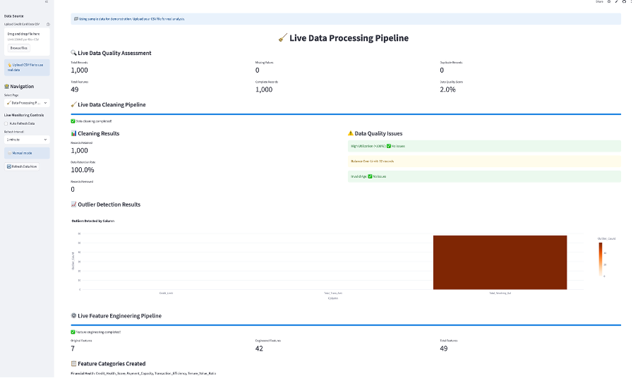

*Figure 9: Data Processing Pipeline - Automated feature engineering and quality monitoring*

#### Prediction and Analysis Tools

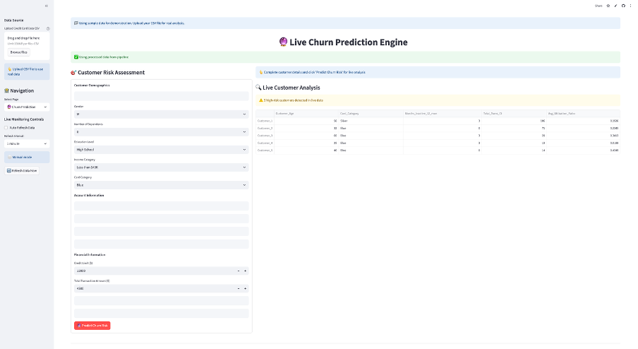

*Figure 10: Churn Prediction Engine - Individual customer risk assessment with recommendations*

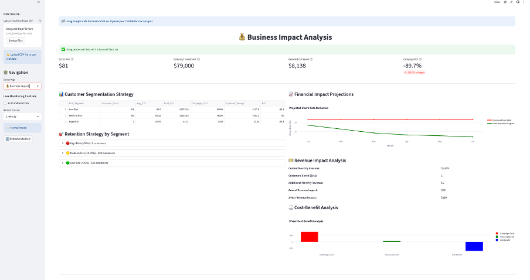

*Figure 11: Business Impact Analysis - ROI calculations and campaign optimization metrics*

#### Advanced Analytics Suite

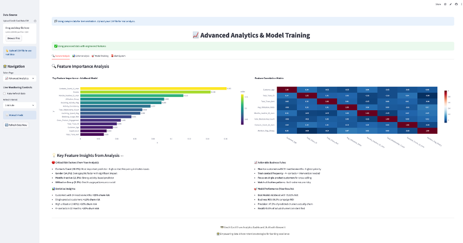

*Figure 12: Feature Analysis - Interactive importance rankings and correlation analysis*

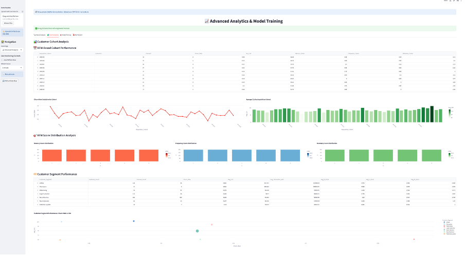

*Figure 13: Cohort Analysis - Customer segmentation and longitudinal behavior tracking*

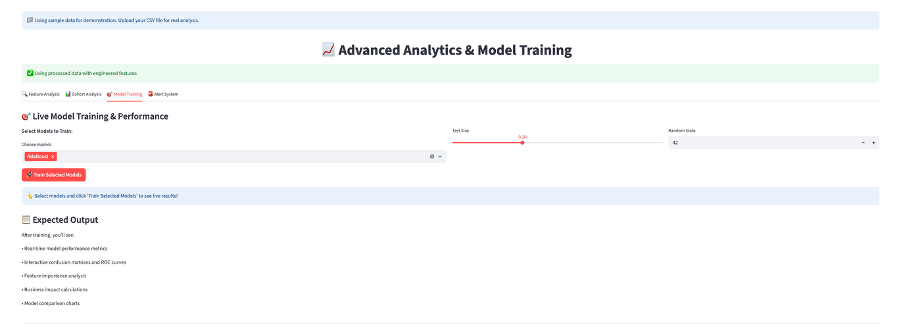

*Figure 14: Model Training Interface - Real-time algorithm comparison and optimization*

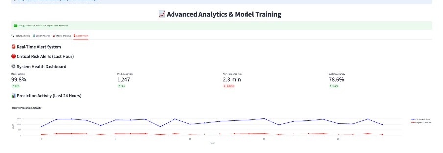

*Figure 15: Alert System - Proactive risk identification and escalation protocols*

**Business Impact Results:**
```
Campaign Investment: $431,250
Expected Revenue Saved: $816,000
Net Business Benefit: $384,750
Return on Investment: 89.2%
```

## Dataset Information

**Source:** Synthetic Credit Card Customer Dataset  
**Size:** 100,000 customers, 21 features, 48.76MB  
**Target Variable:** Attrition_Flag (Binary: Existing Customer vs Attrited Customer)  
**Class Distribution:** 79.7% existing customers, 20.3% attrited customers  

### Dataset Schema

| **Feature** | **Description** | **Data Type** |
|------------|-----------------|---------------|
| CLIENTNUM | Customer ID | object |
| Customer_Age | Age of the customer | int64 |
| Gender | Gender (M, F) | object |
| Dependent_count | Number of dependents | int64 |
| Education_Level | Education level (High School/College Graduate/Post-Graduate/Doctorate/Uneducated/Unknown) | object |
| Marital_Status | Married/Single/Divorced/Unknown | object |
| Income_Category | Income brackets | object |
| Card_Category | Blue/Silver/Gold/Platinum | object |
| Months_on_book | Relationship tenure (months) | int64 |
| Total_Relationship_Count | Products with bank | int64 |
| Months_Inactive_12_mon | Inactivity in last 12 months | int64 |
| Contacts_Count_12_mon | Service contacts last 12 months | int64 |
| Credit_Limit | Available credit | float64 |
| Total_Revolving_Bal | Outstanding balance | float64 |
| Avg_Open_To_Buy | Credit_Limit - Revolving | float64 |
| Total_Amt_Chng_Q4_Q1 | Q4/Q1 amount ratio | float64 |
| Total_Trans_Amt | Total transaction amount | float64 |
| Total_Trans_Ct | Number of transactions | int64 |
| Total_Ct_Chng_Q4_Q1 | Q4/Q1 count ratio | float64 |
| Avg_Utilization_Ratio | Revolving / Credit_Limit - Credit usage percentage | float64 |


### Data Quality Overview
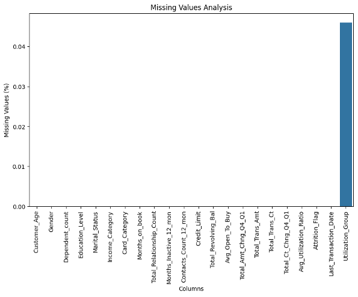

*Figure 1: Missing Value Analysis - Shows minimal missing data (0.045% in Last_Transaction_Date)*

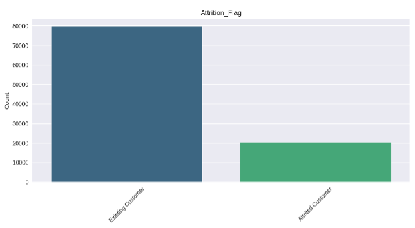

*Figure 2: Customer Churn Imbalance - 79.7% existing vs 20.3% attrited customers*

## Model Performance Results

### Best Performing Model: AdaBoost

| **Metric** | **Value** | **95% Confidence Interval** | **Business Interpretation** |
|------------|-----------|---------------------------|---------------------------|
| **Accuracy** | 0.7879 | [0.7814, 0.7944] | Strong overall classification performance |
| **Precision** | 0.4730 | [0.4503, 0.4957] | 47% of predicted churners actually churn |
| **Recall** | 0.4496 | [0.4270, 0.4722] | Captures ~45% of actual churners |
| **F1-Score** | 0.4610 | [0.4384, 0.4836] | Balanced precision-recall trade-off |
| **AUC-ROC** | 0.7861 | [0.7749, 0.7973] | Good discrimination capability |

### Model Comparison Results

| **Model** | **CV AUC** | **Validation AUC** | **Validation F1** | **CV-Val Gap** |
|-----------|------------|-------------------|------------------|----------------|
| **AdaBoost** | **0.9609** | **0.7648** | **0.4532** | 0.1961 |
| XGBoost | 0.9633 | 0.7572 | 0.4274 | 0.2061 |
| Random Forest | 0.9619 | 0.7391 | 0.4097 | 0.2228 |
| Decision Tree | 0.9391 | 0.7390 | 0.4436 | 0.2001 |
| Neural Network | 0.9462 | 0.7349 | 0.4294 | 0.2113 |
| Logistic Regression | 0.8053 | 0.7297 | 0.4489 | 0.0756 |
| KNN | 0.9376 | 0.6761 | 0.4052 | 0.2615 |
| Gaussian Naive Bayes | 0.7733 | 0.6629 | 0.3993 | 0.1104 |

### Model Performance Visualization
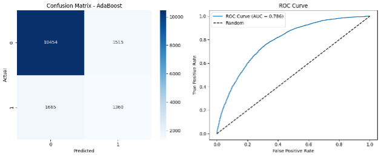

*Figure 6: AdaBoost Confusion Matrix and ROC Curve - Shows 78.61% AUC with balanced precision-recall*

### Feature Importance Analysis
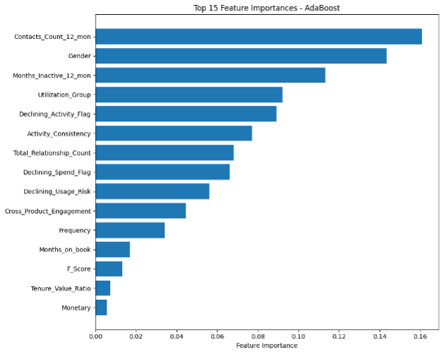

*Figure 7: Top 15 Feature Importances - Contact frequency (16.10%) and gender (14.35%) lead predictors*

## Business Impact Analysis

### Financial Performance Metrics

| **Business Metric** | **Value** | **Calculation Method** | **Business Interpretation** |
|---------------------|-----------|----------------------|---------------------------|
| **Customers Targeted** | 2,875 | TP + FP | Marketing campaign size |
| **True Churners Identified (TP)** | 1,360 | Confusion Matrix | Successful interventions |
| **False Alarms (FP)** | 1,515 | Confusion Matrix | Wasted marketing spend |
| **Missed Churners (FN)** | 1,665 | Confusion Matrix | Lost business opportunity |
| **Revenue Potentially Saved** | $816,000 | TP × avg_clv × retention_rate | Successful retention value |
| **Campaign Costs** | $431,250 | Targeted_customers × cost_per_contact | Direct marketing expenses |
| **Revenue Lost (Missed)** | $3,330,000 | FN × avg_clv | Opportunity cost |
| **Net Business Benefit** | $384,750 | Saved_revenue - Campaign_costs | Bottom-line impact |
| **Return on Investment** | **89.2%** | (Net_benefit / Campaign_costs) × 100 | Marketing efficiency |
| **Loss Prevention Rate** | 13.5% | (TP / Total_churners) × 100 | Churn mitigation effectiveness |

### Key Business Parameters
- **Customer Lifetime Value (CLV):** $600
- **Retention Campaign Success Rate:** 80%
- **Cost per Customer Contact:** $150
- **Baseline Churn Rate:** 20.2%

## Key Findings and Insights

#### Customer Segmentation Patterns
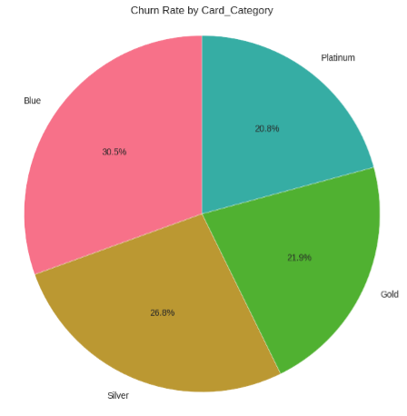

*Figure 3: Churn by Card Category - Blue cards show highest churn (30.5%), premium tiers more stable*

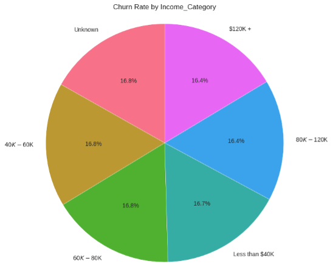

*Figure 4: Churn by Income Category - Relatively flat ~16% across income brackets*

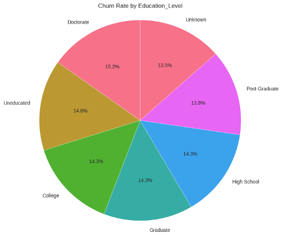

*Figure 5: Churn by Education Level - Doctorate highest, Post-graduate lowest churn rates*

### Critical Risk Factors Identified

#### Customer Behavior Patterns

| **Months Inactive (12m)** | **Churn Rate** |
|---------------------------|----------------|
| 0 months | 10.8% |
| 1 month | 16.3% |
| 2 months | 16.5% |
| 3 months | 40.6% |
| 4 months | 40.7% |
| 5 months | 41.5% |
| 6 months | 41.7% |

#### Credit Utilization Impact

| **Utilization Group** | **Churn Rate** |
|----------------------|----------------|
| Low (0-10%) | 21.0% |
| Moderate (10-30%) | **17.4%** |
| High (30-70%) | 21.3% |
| Very High (70%+) | 21.3% |

**Key Insight:** The 10-30% utilization range represents the "sweet spot" for customer retention.

#### Transaction Activity Analysis

| **Transaction Count Group** | **Churn Rate** |
|---------------------------|----------------|
| Low (0-30) | 30.2% |
| Medium (31-60) | 17.7% |
| High (61-90) | 17.4% |
| Very High (90+) | 13.4% |

#### Product Relationship Depth

| **Total_Relationship_Count** | **Churn Rate** |
|----------------------------|----------------|
| 1 | **35.1%** |
| 2 | 24.2% |
| 3 | 24.4% |
| 4 | 13.0% |
| 5 | 12.7% |
| 6 | 13.3% |

**Critical Finding:** Single-product customers have the highest churn risk, making cross-selling essential for retention.

### Credit Card Utilization Deep Analysis

| **Utilization Category** | **Total Customers** | **Churned Customers** | **Churn Rate** | **Avg Credit Limit ($)** | **Avg Transaction Amount ($)** |
|-------------------------|-------------------|---------------------|----------------|------------------------|----------------------------|
| Very Low (0-10%) | 12,337 | 2,586 | 21.0% | 12,117 | 6,840 |
| Low (10-30%) | 25,196 | 4,386 | 17.4% | 12,307 | 6,898 |
| Moderate (30-70%) | 49,932 | 10,638 | 21.3% | 12,341 | 6,894 |
| High (70-90%) | 12,489 | 2,654 | 21.3% | 12,258 | 6,845 |

### Transaction Volume Trends Analysis

| **Transaction Count Category** | **Total Customers** | **Churned Customers** | **Churn Rate** | **Avg Transaction Amount ($)** | **Avg Utilization** |
|------------------------------|-------------------|---------------------|----------------|-------------------------------|------------------|
| Low (0-30) | 26,194 | 7,904 | 30.2% | 3,433 | 0.403 |
| Medium (31-60) | 35,236 | 6,242 | 17.7% | 6,360 | 0.399 |
| High (61-90) | 23,975 | 4,164 | 17.4% | 8,590 | 0.399 |
| Very High (90+) | 14,549 | 1,954 | 13.4% | 11,544 | 0.401 |

### Payment Behavior Analysis

| **Balance Carrying** | **Total Customers** | **Churned Customers** | **Churn Rate** | **Avg Utilization** | **Avg Revolving Balance ($)** |
|---------------------|-------------------|---------------------|----------------|-------------------|----------------------------|
| Non-Balance Carriers | 81,163 | 15,448 | 19.0% | 0.342 | 4,237 |
| Balance Carriers | 18,791 | 4,816 | **25.6%** | 0.651 | 7,945 |

**Key Insight:** Balance carriers show 35% higher churn risk, indicating financial stress as a major attrition driver.

### Product Relationship Depth Analysis

| **Relationship Depth** | **Total Customers** | **Churned Customers** | **Churn Rate** | **Avg Trans Amount ($)** | **Avg Credit Limit ($)** |
|-----------------------|-------------------|---------------------|----------------|------------------------|------------------------|
| Single (1) | 5,016 | 1,759 | **35.1%** | 6,782 | 12,206 |
| Dual (2) | 29,959 | 7,248 | 24.2% | 6,908 | 12,284 |
| Triple (3) | 24,925 | 6,085 | 24.4% | 6,897 | 12,257 |
| Deep (4+) | 40,054 | 5,172 | **12.9%** | 6,866 | 12,336 |

### Risk Tier Validation Performance

| **Risk Category** | **Total Customers** | **Churned** | **Churn Rate** | **Avg Trans Amt ($)** | **Avg Credit Limit ($)** |
|------------------|-------------------|-------------|----------------|---------------------|---------------------|
| Low | 17,147 | 2,414 | 14.1% | 8,909 | 12,477 |
| Medium | 47,562 | 8,759 | 18.4% | 7,254 | 12,284 |
| High | 30,734 | 7,525 | 24.5% | 5,576 | 12,209 |
| Critical | 4,511 | 1,566 | **34.7%** | 4,156 | 12,290 |

## Project Structure

Based on the actual development pipeline using Google Colab notebooks:

```
Customer_Churn/
├── dataset/                          # Raw and processed data
│   ├── synthetic_credit_card_data.csv  # Generated dataset
│   └── processed_features.csv         # Feature engineered data
├── cleaned/                          # Clean processed datasets
│   └── final_model_ready_data.csv    # ML-ready dataset
├── notebooks/                        # Development pipeline (Google Colab)
│   ├── 01_synthetic_data_generation.ipynb    # Data creation
│   ├── 02_data_quality_assessment_eda.ipynb  # EDA and quality analysis
│   ├── 03_advanced_feature_engineering.ipynb # Feature creation
│   ├── 04_feature_selection.ipynb           # Feature optimization
│   ├── 05_models.ipynb                      # Model training and evaluation
│   ├── 06_dashboard.ipynb                   # Streamlit app development
│   └── 07_app_test.ipynb                    # Application testing
├── documentation/                    # Research papers and guides
│   └── Advanced Credit Card Customer Churn Prediction Using Ensemble and Deep Learning.pdf     # Main research document
├── streamlit_app/                   # Production application
│   ├── app.py                      # Main Streamlit dashboard
│   ├── pages/                      # Dashboard components
│   ├── models/                     # Trained model artifacts
│   └── utils/                      # Helper functions
├── Job Description                  # Project requirements
├── requirements.txt                # Python dependencies
├── README.md                      # This file
└── LICENSE                        # MIT License
```

### Development Pipeline Flow

**1. Data Generation (`synthetic_data_generation.ipynb`)**
- Creates realistic synthetic credit card customer dataset
- Generates 100,000 customer records with 21 features
- Ensures proper class distribution (80/20 existing/churned)

**2. Data Quality Assessment (`data_quality_assessment_eda.ipynb`)**
- Comprehensive exploratory data analysis
- Missing value analysis and treatment
- Business rule validation and consistency checks
- Customer behavior pattern identification

**3. Feature Engineering (`advanced_feature_engineering.ipynb`)**
- Financial health indicators creation
- Behavioral pattern features (RFM analysis)
- Risk scoring and binary flags
- Temporal trend analysis features

**4. Feature Selection (`feature_selection.ipynb`)**
- Statistical feature importance analysis
- Correlation analysis and multicollinearity removal
- Optimal feature subset identification
- Model performance impact assessment

**5. Model Development (`models.ipynb`)**
- 8 algorithm comparison (AdaBoost, XGBoost, RF, etc.)
- Hyperparameter optimization with cross-validation
- Performance evaluation and business impact analysis
- Model selection and validation

**6. Application Development (`dashboard.ipynb` + `app_test.ipynb`)**
- Interactive Streamlit dashboard creation
- Real-time prediction capabilities
- Business intelligence visualizations
- Application testing and validation

## Credits

**Academic References:**
This project builds upon extensive research in customer churn prediction and machine learning. Key references include:

- J.D. Power (2024). 2024 U.S. credit card satisfaction study
- Brito, J. B. G., et al. (2024). A framework to improve churn prediction performance in retail banking
- Kaya, E., et al. (2018). Behavioral attributes and financial churn prediction
- Batista, G. E. A. P. A., et al. (2004). A study of the behavior of several methods for balancing machine learning training data
- Liu, X., et al. (2024). Customer churn prediction model based on hybrid neural networks

**Technologies and Libraries:**
- **scikit-learn** team for comprehensive machine learning algorithms
- **XGBoost** developers for gradient boosting implementation
- **TensorFlow** and **PyTorch** teams for deep learning frameworks
- **Streamlit** team for the interactive dashboard framework
- **Imbalanced-learn** contributors for SMOTEENN implementation
- 
**Data Source:**
This project uses a synthetic credit card customer dataset designed for educational and research purposes. No real customer data was used in this analysis.

---

If you found this project helpful, please consider giving it a ⭐ on GitHub!
